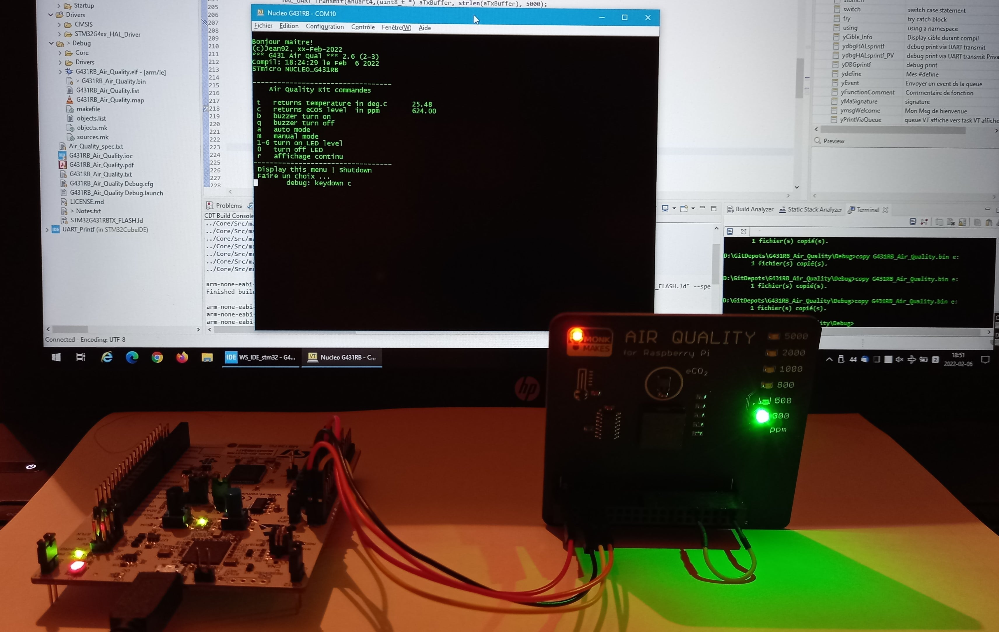
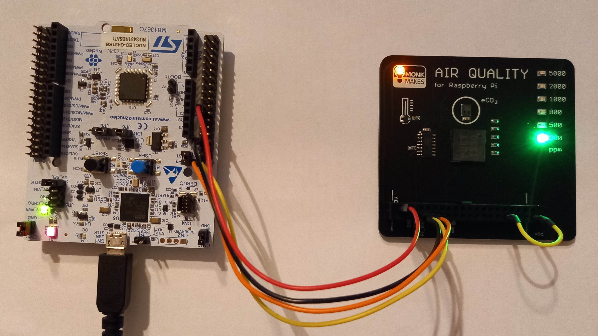

<!---
\mainpage
-->

# G431RB_Air_Quality

Interface pour MonkMakes Air Quality Kit  

  

## Hardware
Nucleo-G431RB  
[MonkMakes Air Quality Kit](http://monkmakes.com/pi_aq.html) (for Raspberry Pi) by Elektor  

## Software
STM32CubeIDE v1.8.0  
STM32CubeMX  
STM32CubeG4 Firmware Package V1.5.0  
Prog C

## Fonctionnalities
La carte Nucleo-G431RB gere l'interface avec le kit et la console sur PC.  
Le protocole d'interface est simple et bien décrit dans la documentation.  
Implentation de ce protocole dans la carte Nucleo via port UART4.  
*future* ajouter capteur humidité.  

##### Inputs
BP1 (interrupt) : *futre use*   
Console VT100 via debug LPUART1:  
>Menu des commandes  
>Affichage des retours du Kit    

##### Outputs
Uart4 linked to Air Quality Kit

## Program design
*in progress*

## Version
##### v2.6: connection et test du Kit 
##### v2.4: simulation avec une console en lieu et place du kit
##### v1.0: creation avec CubeMX

## Authors
**yJPO92 (Jean92)** - fev. 2022

## License
This project is licensed under the [CC0 1.0 Universal](LICENSE.md)
Creative Commons License - see the [LICENSE.md](LICENSE.md) file for
details
